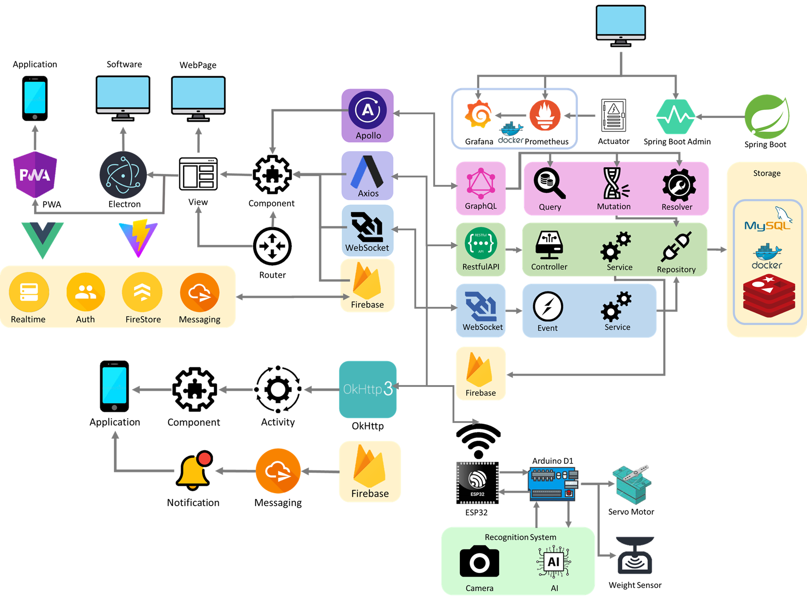
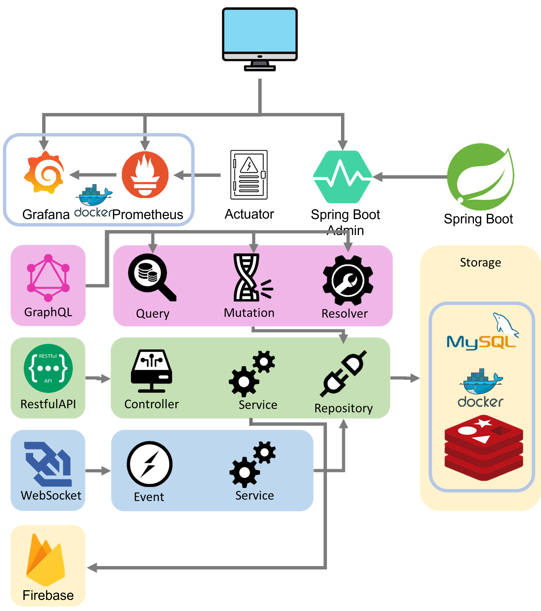

<span style="text-align: center">

# Garbage Classifier Backend
### Yuntech Information management department System Analysis and Design G6 Teamwork


</span>


----


[Local Web Interface Page SwaggerUI](http://localhost:8080/swagger-ui/index.html)

[Remote Web Interface Page SwaggerUI](http://140.125.207.230:8080/swagger-ui/index.html)

[Server Manage Interface Prometheus Panel](http://140.125.207.230:9090/)

[Server Manage Interface Garfana Panel](http://140.125.207.230:4000/)


----

##### Future Feature

Distribute System Use Messaging Queue

[RabbitMQ Messaging Manage Panel](http://140.125.207.230:15672/)

----

### Structure of Project

> Involve Application Frontend Backend Hardware

[Application Project](https://github.com/lavender0526/Garbage_Classifier_App)

[Frontend Project](https://github.com/fan9704/Garbage_Classifier_Frontend)

[Backend Project](https://github.com/fan9704/Garbage_Classifier_Backend)

[Hardware Project](https://github.com/fan9704/Garbage_Classifier_Hardware)

----

### Software Architecture




----


----

### Backend Architecture



----

### Web Interface Detail (Port number 8080)
#### User
- User Register Post:/api/register
- User Login Post:/api/login
- User ChangePassword Put:/api/changePassword
- User GetUserInfoByUsername Get:/api/userinfo/{username}
- User EditUserInfo Put:/api/EditUserInfo
- Check UserLoginStatus /Get:/api/checkLogin
- User Logout /Get:/api/logout
- Save User Firebase Cloud Messaging Token Post:/api/saveToken
- **Register Api Will auto create user wallet and account**
#### Wallet
- Get WalletValueByUsername Get:/api/walletValue/{username}
- List WalletInfoByUsername Get:/api/walletInfo/{username}
#### Machine
- Get All Machines By Location Get:/api/machines/location?location={location}
- Link User Machine Patch:/api/machine/{machineId}/link/{userId}
- UnLink User Machine Patch:/api/machine/{machineId}/unlink
- Lock Machine Patch:/machine/lock/{machineId}
- Unlock Machine Patch:/machine/unlock/{machineId}
- Update Recycle Record Patch:/api/machine/{machineId}
- Update Machine Picture Patch:/api/machine/picture/{machineId}
- **Create Machine Will Auto Create Any Garbage Type Of Machine Storage Data**
#### MachineStorage
- Update MachineStorage Patch:/api/machine_storage
- Read MachineStorage By Machine Get:/api/machine_storage/machine/{ID}
- Read MachineStorage By GarbageType Get:/api/machine_storage/garbage_type/{ID}
#### BankAcct
- Read BankAccount By Username Get:/api/back_acct/username/{username}
- Update User BankAccount Patch:/api/bank_acct/user
#### Every API Feature
- Create something Post:/api/something
- Read something By ID  GET:/api/something/{ID}
- Update something Put:/api/something/{ID}
- Delete something Delete:/api/something/{ID}
- Read all something GET:/api/somethings
- Update piece of something Patch:/api/something/{ID}

### GraphQL Interface (Port Number 8080/graphql)

GraphQL Schema

> Schema Location **src/main/resource/graphql**

### Manager Server Interface (Port number 8000)
Use Actuator and Micrometer

----

## Run Spring Boot application
```shell
mvn spring-boot:run
```

## Pack Backend to jar
```shell
mvn clean install
```

## Build Backend Docker Image
```shell
docker build -t GCBackend .
```

## Run With Docker Container
```shell
docker run -p 8080:8080 GCBackend
```

## shutdown through bash
```shell
 sudo lsof -i :8080 | grep LISTEN
 kill <PID>
```

